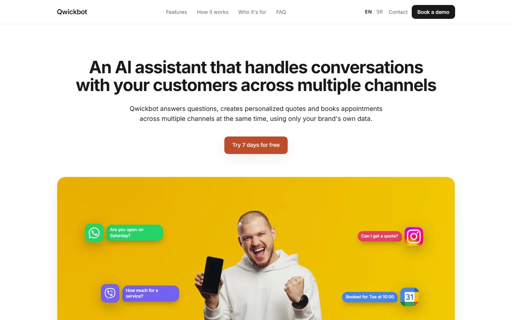
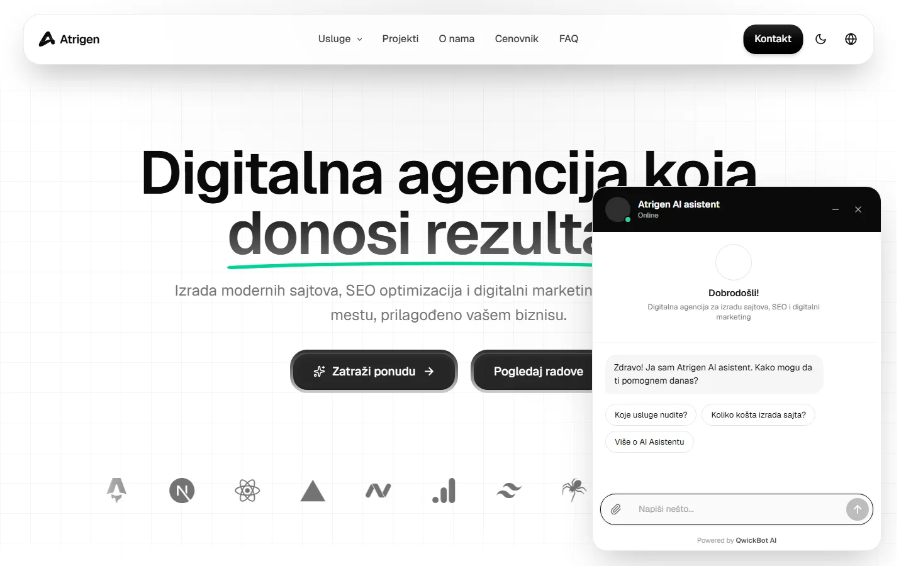
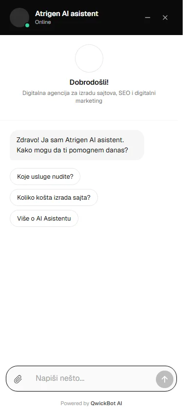
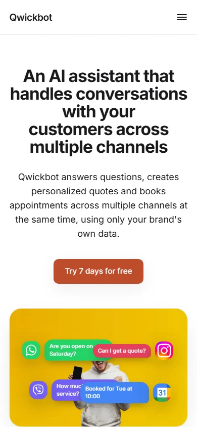
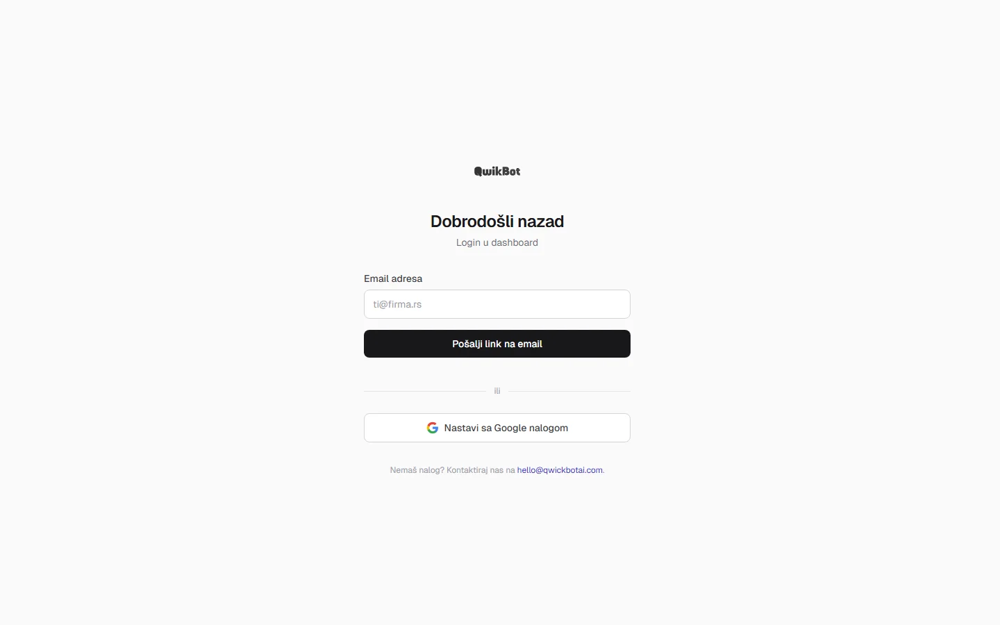

# AtriBot: AI chatbot SaaS za uslužne biznise

**Live:** [app.atribotai.com](https://app.atribotai.com) · **Widget u produkciji:** [atrigen.rs](https://atrigen.rs)

AtriBot je multi-tenant SaaS koji uslužnim biznisima (saloni, stomatolozi, agencije, servisi) daje AI asistenta. Asistent odgovara klijentima na sajtu, WhatsApp-u i Instagramu, pravi ponude, hvata leadove i zakazuje termine direktno u Google Calendar. Odgovara isključivo iz baze znanja tog biznisa. Ako odgovor nije u bazi, ne izmišlja nego to jasno kaže.



## Tech stack


## Šta radi

- **Widget za sajt:** jedna `<script>` linija. Vanilla TypeScript u zatvorenom Shadow DOM-u, bez framework-a i bez `innerHTML` (Trusted Types friendly). Razgovor preživljava navigaciju između stranica, a slanje fajlova radi preko drag & drop-a i paste-a.
- **Više kanala, jedan mozak:** sajt, WhatsApp (QR pairing) i Instagram DM koriste istu bazu znanja i isti tok razgovora.
- **Zakazivanje termina:** Google Calendar OAuth, predlog više slobodnih termina, razumevanje prirodnog jezika („sutra posle podne", „može malo kasnije") i potvrda mejlom klijentu.
- **Lead capture:** prepoznaje zainteresovanog klijenta i vlasniku odmah šalje mejl sa transkriptom razgovora.
- **Fajlovi i slike:** multimodalni router šalje slike vision modelu, a dokumente tekstualnom. Validacija ide po magic bajtovima, ne po ekstenziji.
- **Dashboard za vlasnika:** razgovori, baza znanja, prilagođavanje widget-a sa live preview-om (boja brenda sa auto-kontrastom, avatar), integracije i ograničenja teme.

## AI i baza znanja (RAG)

- **Contextual retrieval:** svaki chunk dobija kontekst dokumenta pre embedovanja
- **Hibridna pretraga:** vektorska (Vectorize) i BM25 (SQLite FTS5) spojene u jedan rezultat
- **Reranker** (bge-reranker) nad kandidatima, pa **abstention prag**: kad nema dovoljno dobrog izvora, bot kaže da ne zna umesto da halucinira
- **Layered context prompt:** XML envelope sa jasnom hijerarhijom poverenja (sistemska pravila > stanje razgovora > znanje > poruka korisnika), otporan na prompt injection
- **LLM fallback lanac** sa više provajdera, pa kvar jednog provajdera ne ruši bota
- Uvoz znanja iz URL-a, sitemap-a ili teksta, sa pregledom pre ubacivanja

## Bezbednost

- Magic link i Google OAuth login, plus **WebAuthn passkeys** za admin pristup
- **Enkripcija po tenantu:** svaki biznis ima sopstveni data key (envelope encryption), a osetljivi podaci integracija su šifrovani u bazi
- Stroga CSP pravila, izolovan widget, origin allowlist po tenantu, rate limiting
- WhatsApp stack na zasebnom serveru iza Cloudflare Tunnel-a sa trostrukom autentifikacijom (Access token, HMAC potpis, API ključ), LUKS enkriptovan disk i šifrovani backup-i
- Više internih bezbednosnih audita, a svi nalazi su zatvoreni pre produkcije

## Arhitektura

```
Sajt klijenta ─┐
WhatsApp ──────┼──▶ Cloudflare Worker (API) ──▶ D1 · KV · R2 · Vectorize · Workers AI
Instagram ─────┘            │                         │
                            ├──▶ LLM provajderi       └──▶ Google Calendar · Resend
                            │
Dashboard (Astro na CF Pages) ◀── vlasnik biznisa
```

## Screenshots

### Widget (desktop)



### Widget i landing (mobile)

<p>
  
  &nbsp;
  
</p>

### Dashboard login



---

Kod je privatan. Ovaj repo služi samo kao prikaz projekta.
